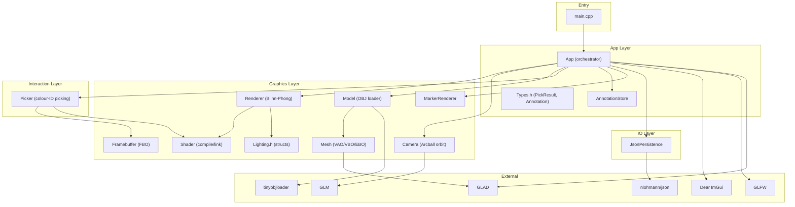
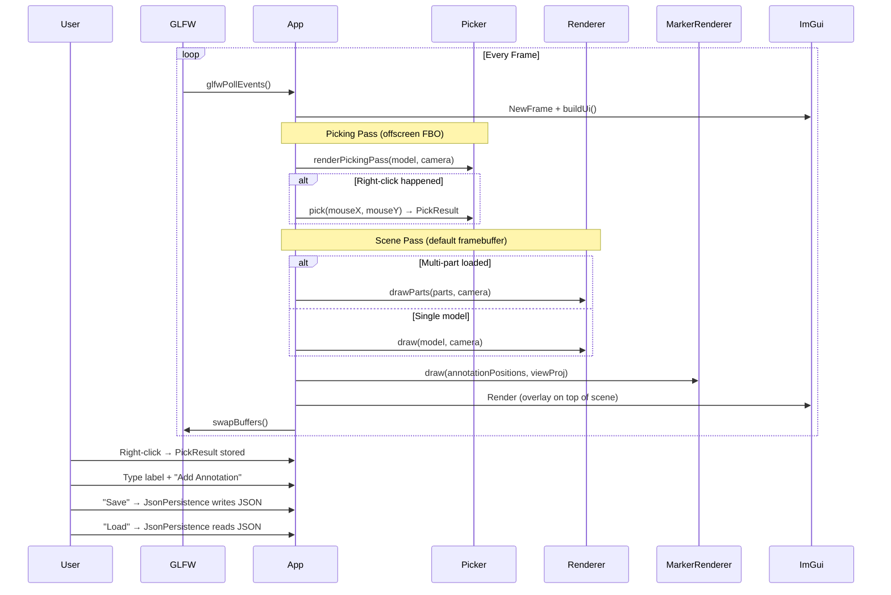

# 3D Corpus Visualiser

An interactive platform for exploring 3D anatomical models. Students and educators can upload, label, and annotate complex anatomical structures in a real-time OpenGL viewport.

---

## Milestone 6 — Measurement Tool · Screenshot Export · Search/Filter · Keyboard Shortcuts

Milestone 6 builds on top of Milestones 1–5 with four high-impact "wow factor" features.

### What's new in Milestone 6

| Feature | Details |
|---|---|
| **Measurement Tool** | Switch to Measure mode; right-click to place up to 3 points; distance (P1→P2) and angle (at P2) are computed and displayed; cyan line segments drawn in the 3-D scene |
| **Screenshot export** | Press **F12** or click **Capture PNG** to save the current viewport as a timestamped PNG in `data/screenshots/` |
| **Search / filter annotations** | Case-insensitive substring filter field above the annotation list; visible count shown next to total |
| **Keyboard shortcuts** | Full shortcut table (see below); all shortcuts ignored while ImGui has keyboard focus |
| **Mode toggle (UI + keyboard)** | Radio buttons in the panel and **A** / **M** keys switch between Annotate and Measure modes |

### Keyboard shortcuts

| Key | Action |
|---|---|
| **A** | Switch to **Annotate** mode |
| **M** | Switch to **Measure** mode |
| **R** | Reset camera (re-centres and fits model) |
| **Delete** | Delete the currently selected annotation (Annotate mode only) |
| **Ctrl + S** | Save annotations to the JSON file |
| **Ctrl + L** | Load annotations from the JSON file |
| **F12** | Take a screenshot (saved to `data/screenshots/`) |

> Shortcuts are suppressed while ImGui has keyboard focus (e.g. when typing in a text field).

### Measurement tool usage

1. Click the **Measure** radio button in the panel or press **M**.
2. **Right-click** on the model to place the first point (P1) — a cyan dot appears.
3. Right-click a second location to place P2.  
   → A cyan line is drawn and the **distance** P1→P2 is shown.
4. Optionally right-click a third point (P3).  
   → The **angle** at P2 (P1–P2–P3) is computed and shown in degrees.
5. Click **Clear Measurement** to reset and start over.

### Screenshot export

- Screenshots are automatically saved to `data/screenshots/screenshot_YYYYMMDD_HHMMSS.png`.
- The directory is created automatically if it does not exist.
- The capture is taken from the current framebuffer immediately after the 3-D scene is rendered (ImGui overlay is also captured).

### Search / filter annotations

- Type any substring into the **Search** field above the annotation list.
- The filter is **case-insensitive** and updates live as you type.
- The annotation count line shows both the total count and the number of visible (matching) entries.
- The filter does not affect save/load — all annotations are always persisted regardless of the current filter.

---

## Milestone 5 — JSON Persistence + Final Hardening

### What's new in Milestone 5

| Feature | Details |
|---|---|
| JSON schema (v1) | `schema_version`, `id`, `label`, `position` (x/y/z), `object_id` |
| `JsonPersistence` module | `src/io/JsonPersistence.h/.cpp` — save/load with full validation |
| Save button | Serialises all annotations to the chosen file (default `data/annotations.json`) |
| Load button | Deserialises annotations; replaces current list; id counter updated to avoid collisions |
| Validation & error handling | Malformed JSON, wrong version, missing/invalid fields — all handled gracefully; app stays stable |
| UI status feedback | Green success / red error message shown after every save or load operation |
| Editable file path | Input field above Save/Load buttons lets the user point to any JSON file |

### JSON format

Annotations are stored in a versioned JSON file:

```json
{
  "schema_version": 1,
  "annotations": [
    {
      "id": 1,
      "label": "frontal lobe",
      "position": { "x": 0.123, "y": 0.456, "z": 0.789 },
      "object_id": 1
    },
    {
      "id": 2,
      "label": "temporal region",
      "position": { "x": -0.5, "y": 0.1, "z": 0.3 },
      "object_id": -1
    }
  ]
}
```

**Field reference**

| Field | Type | Required | Notes |
|---|---|---|---|
| `schema_version` | integer | ✅ | Must equal `1`; mismatches are rejected |
| `id` | integer | ✅ | Unique annotation identifier |
| `label` | string | ✅ | Human-readable name |
| `position` | object | ✅ | Must have numeric `x`, `y`, `z` |
| `object_id` | integer | optional | Defaults to `-1` if absent |

---

### Full controls summary

| Input | Action |
|---|---|
| Left mouse drag | Orbit / rotate camera around model |
| Scroll wheel | Zoom in / out |
| Right-click on model (Annotate mode) | Pick a 3-D world-space point for annotation |
| Right-click on model (Measure mode) | Place a measurement point (up to 3) |
| Distance slider | Fine-grained zoom control in the UI panel |
| Label field + Add Annotation | Create an annotation from the current pick |
| Search field | Filter annotation list by case-insensitive substring |
| Click list row | Select / deselect an annotation entry |
| Delete (per row) | Remove that annotation from the store and scene |
| Load / Reload | Load a new OBJ model (clears all annotations) |
| Save | Write annotations to the JSON file shown in the path field |
| Load | Read annotations from the JSON file shown in the path field |
| **A** | Switch to Annotate mode |
| **M** | Switch to Measure mode |
| **R** | Reset camera |
| **Delete** | Delete selected annotation (Annotate mode) |
| **Ctrl + S** | Save annotations |
| **Ctrl + L** | Load annotations |
| **F12** | Capture PNG screenshot |

---

### Project layout

```
corpus-3d-visualizer/
├── CMakeLists.txt              # C++17 build (v0.6)
├── README.md
├── .gitignore
├── external/
│   ├── glad/                   # GLAD GL loader (OpenGL 3.3 Core, bundled)
│   ├── imgui/                  # Dear ImGui (bundled)
│   ├── stb/                    # stb_image_write.h (PNG export, bundled)
│   └── tinyobjloader/          # tinyobjloader single-header (bundled)
├── assets/
│   ├── models/
│   │   └── cube.obj            # Default test model (unit cube with normals)
│   └── shaders/
│       ├── mesh.vert / .frag   # Blinn-Phong shading
│       ├── picking.vert / .frag# FBO colour-ID picking
│       ├── marker.vert / .frag # Annotation point-sprite markers
│       └── line.vert / .frag   # Measurement line segments (Milestone 6)
├── data/
│   ├── annotations.json        # Persisted labels (written by Save, read by Load)
│   └── screenshots/            # Auto-created; timestamped PNG captures (Milestone 6)
├── src/
│   ├── main.cpp
│   ├── app/
│   │   ├── App.h / .cpp        # Application class (Milestone 6 additions)
│   │   ├── AnnotationStore.h / .cpp  # In-memory annotation store
│   │   └── Types.h             # PickResult, Annotation, InteractionMode
│   ├── graphics/
│   │   ├── Lighting.h          # DirectionalLight + Material structs
│   │   ├── Shader.h / .cpp     # Compile, link, uniform API
│   │   ├── Mesh.h / .cpp       # VAO/VBO/EBO, indexed + non-indexed draw
│   │   ├── Model.h / .cpp      # tinyobjloader parsing, bounding sphere
│   │   ├── Camera.h / .cpp     # Arcball orbit camera
│   │   ├── Renderer.h / .cpp   # Blinn-Phong forward pass
│   │   ├── Framebuffer.h / .cpp# FBO creation/resize/readback
│   │   ├── MarkerRenderer.h / .cpp  # Annotation point-sprite markers
│   │   └── LineRenderer.h / .cpp    # Measurement line segments (Milestone 6)
│   ├── interaction/
│   │   └── Picker.h / .cpp     # Colour-ID encode/decode, picking pipeline
│   └── io/
│       ├── JsonPersistence.h / .cpp  # JSON save/load with schema validation
│       └── Screenshot.h / .cpp       # PNG framebuffer capture (Milestone 6)
```

### System requirements

| Tool / Library | Minimum version |
|---|---|
| CMake | 3.16 |
| GCC / Clang / MSVC | C++17 support |
| GLFW | 3.3 (system package or bundled) |
| OpenGL | 3.3 Core (Mesa or GPU driver) |
| GLM | 0.9.9 (system package or auto-fetched via FetchContent) |
| nlohmann/json | 3.10 (system package or auto-fetched via FetchContent) |

#### Linux (Ubuntu / Debian)

```bash
sudo apt-get update
sudo apt-get install -y cmake build-essential libglfw3-dev libgl-dev libglm-dev
```

#### macOS

```bash
brew install cmake glfw glm nlohmann-json
```

#### Windows (MSYS2 MinGW64)

```bash
pacman -S --needed \
  mingw-w64-x86_64-cmake \
  mingw-w64-x86_64-ninja \
  mingw-w64-x86_64-toolchain \
  mingw-w64-x86_64-glfw \
  mingw-w64-x86_64-glm \
  mingw-w64-x86_64-nlohmann-json
```

> **Note:** If GLM or nlohmann/json are not found by `find_package`, CMake automatically
> fetches them from GitHub via `FetchContent` (requires internet access during the first
> configure).

---

### Build

```bash
# 1. Clone
git clone https://github.com/AryaNarkhede/corpus-3d-visualizer.git
cd corpus-3d-visualizer

# 2. Configure
cmake -S . -B build

# 3. Build
cmake --build build -j

# 4. Run
./build/bin/corpus_visualizer
```

On **Windows** with MSVC the binary will be at `build\bin\corpus_visualizer.exe`.

---

### Loading your own OBJ model

1. Copy your `.obj` (and optional `.mtl`) file into `assets/models/`.
2. Launch the app.
3. In the **"3D Corpus Visualiser"** ImGui panel, update the path in the text field
   (e.g. `/absolute/path/to/my_model.obj` or a relative path) and click **Load / Reload**.

The renderer auto-centres and normalises the model to fit a unit bounding sphere, so any scale of OBJ file will display correctly.

---

### End-to-end demo (Milestone 6)

```bash
# 1. Build
cmake -S . -B build && cmake --build build -j

# 2. Run
./build/bin/corpus_visualizer

# ── Annotate mode (default) ─────────────────────────────────────────────
# 3. Right-click on the model → pick a world-space point
# 4. Type a label (e.g. "frontal lobe") → Add Annotation
#    Yellow dot appears on the model
# 5. Type "fron" in the Search field → only matching annotations shown
# 6. Press Ctrl+S → data/annotations.json written

# ── Measure mode ────────────────────────────────────────────────────────
# 7. Press M  (or click "Measure" radio)
# 8. Right-click two points → cyan line drawn, distance shown in panel
# 9. Right-click a third point → angle at P2 shown in panel
# 10. Click "Clear Measurement" to reset

# ── Screenshot ──────────────────────────────────────────────────────────
# 11. Press F12 → data/screenshots/screenshot_<timestamp>.png written
#     Status shown in the Screenshot section of the panel

# ── Keyboard shortcuts ──────────────────────────────────────────────────
# R          → reset camera
# A          → Annotate mode
# M          → Measure mode
# Delete     → delete selected annotation
# Ctrl+S     → save annotations
# Ctrl+L     → load annotations
# F12        → screenshot
```

---

## Roadmap

| Milestone | Description |
|---|---|
| **1** ✅ | CMake + GLFW window + Dear ImGui boilerplate |
| **2** ✅ | OBJ model loading, Blinn-Phong shading, Arcball camera |
| **3** ✅ | FBO colour-picking pipeline (click → world coordinates) |
| **4** ✅ | ImGui annotation workflow (label + store + scene markers) |
| **5** ✅ | JSON persistence (save / load annotations) + final hardening |
| **6** ✅ | Measurement tool · Screenshot export · Search/filter · Keyboard shortcuts |

# Corpus 3D Visualizer — Tech Stack & System Overview

## Tech Stack

### Language & Standard
| Component | Detail |
|---|---|
| **Language** | C++ |
| **Standard** | C++17 (`std::filesystem`, structured bindings, etc.) |
| **Build System** | CMake 3.16+ |
| **Compiler Support** | MSVC (Windows), GCC, Clang (Linux/macOS) |

---

### Core Libraries

| Library | Version | Role | Bundled? |
|---|---|---|---|
| **OpenGL** | 3.3 Core Profile | GPU rendering API — all draw calls, shaders, FBOs | System |
| **GLFW** | 3.3+ | Window creation, OpenGL context, keyboard/mouse input | System |
| **GLAD** | OpenGL 3.3 Core | OpenGL function loader (resolves GL function pointers at runtime) | ✅ `external/glad/` |
| **Dear ImGui** | v1.91.9 | Immediate-mode GUI — panels, sliders, buttons, text inputs | ✅ `external/imgui/` |
| **GLM** | 0.9.9+ | Math library — vectors, matrices, transforms (header-only) | Auto-fetched via CMake FetchContent |
| **tinyobjloader** | v2.0.0-rc13 | Wavefront `.obj` file parser (single-header) | ✅ `external/tinyobjloader/` |
| **nlohmann/json** | 3.10+ | JSON serialization/deserialization for annotation persistence | Auto-fetched via CMake FetchContent |

---

### Shader Programs (GLSL 330 core)

| Shader Pair | Purpose |
|---|---|
| `mesh.vert` / `mesh.frag` | **Blinn-Phong** lit rendering of 3D models |
| `picking.vert` / `picking.frag` | **Colour-ID** offscreen pass for mouse picking |
| `marker.vert` / `marker.frag` | **Point-sprite** annotation markers (yellow circles) |

All shaders live in [assets/shaders/](file:///c:/Users/kunal/OneDrive/Desktop/corpus-3d-visualizer/assets/shaders).

---

## System Overview

### Architecture Diagram



---

### Module Breakdown

#### 1. `src/app/` — Application Layer

| File | Purpose |
|---|---|
| [App.h](file:///c:/Users/kunal/OneDrive/Desktop/corpus-3d-visualizer/src/app/App.h) / [App.cpp](file:///c:/Users/kunal/OneDrive/Desktop/corpus-3d-visualizer/src/app/App.cpp) | **Central orchestrator** — initializes GLFW/GLAD/ImGui, owns all subsystems, runs the main loop (`init → run → shutdown`), wires GLFW callbacks, builds the ImGui UI |
| [AnnotationStore.h/.cpp](file:///c:/Users/kunal/OneDrive/Desktop/corpus-3d-visualizer/src/app/AnnotationStore.cpp) | In-memory annotation database — `add`, `remove`, `clear`, `replaceAll`, auto-incrementing IDs |
| [Types.h](file:///c:/Users/kunal/OneDrive/Desktop/corpus-3d-visualizer/src/app/Types.h) | Shared structs: `PickResult` (world position, object ID, depth) and `Annotation` (id, label, worldPos, objectId) |

#### 2. `src/graphics/` — Rendering Layer

| File | Purpose |
|---|---|
| [Renderer.h/.cpp](file:///c:/Users/kunal/OneDrive/Desktop/corpus-3d-visualizer/src/graphics/Renderer.h) | **Forward renderer** — Blinn-Phong shading, `draw()` for single models, `drawParts()` for multi-part anatomical assemblies with per-part colors |
| [Camera.h/.cpp](file:///c:/Users/kunal/OneDrive/Desktop/corpus-3d-visualizer/src/graphics/Camera.h) | **Arcball orbit camera** — left-drag to rotate, scroll to zoom; produces view & projection matrices |
| [Model.h/.cpp](file:///c:/Users/kunal/OneDrive/Desktop/corpus-3d-visualizer/src/graphics/Model.h) | Loads `.obj` files via tinyobjloader, computes bounding sphere (center + radius) for auto-framing |
| [Mesh.h/.cpp](file:///c:/Users/kunal/OneDrive/Desktop/corpus-3d-visualizer/src/graphics/Mesh.h) | Low-level OpenGL geometry — creates VAO/VBO/EBO, supports indexed and non-indexed draw calls |
| [Shader.h/.cpp](file:///c:/Users/kunal/OneDrive/Desktop/corpus-3d-visualizer/src/graphics/Shader.h) | Compiles & links GLSL shaders, provides a typed uniform-setting API |
| [Framebuffer.h/.cpp](file:///c:/Users/kunal/OneDrive/Desktop/corpus-3d-visualizer/src/graphics/Framebuffer.h) | FBO wrapper — colour + depth attachments, resize, pixel readback (used by Picker) |
| [MarkerRenderer.h/.cpp](file:///c:/Users/kunal/OneDrive/Desktop/corpus-3d-visualizer/src/graphics/MarkerRenderer.h) | Renders annotation markers as yellow circular point-sprites in 3D space |
| [Lighting.h](file:///c:/Users/kunal/OneDrive/Desktop/corpus-3d-visualizer/src/graphics/Lighting.h) | Data structs for `DirectionalLight` and `Material` (exposed to ImGui for live tweaking) |

#### 3. `src/interaction/` — Interaction Layer

| File | Purpose |
|---|---|
| [Picker.h/.cpp](file:///c:/Users/kunal/OneDrive/Desktop/corpus-3d-visualizer/src/interaction/Picker.h) | **Colour-ID picking pipeline** — renders the scene to an offscreen FBO with flat-colour object IDs, reads back the pixel under the mouse, unprojects to world-space 3D coordinates |

#### 4. `src/io/` — Persistence Layer

| File | Purpose |
|---|---|
| [JsonPersistence.h/.cpp](file:///c:/Users/kunal/OneDrive/Desktop/corpus-3d-visualizer/src/io/JsonPersistence.h) | **JSON save/load** — serializes annotations to a versioned JSON schema (v1), validates on load, handles malformed files gracefully |

---

### Data & Render Flow



---

### Milestone Roadmap (all completed ✅)

| Milestone | What It Added |
|---|---|
| **1** | CMake project + GLFW window + Dear ImGui boilerplate |
| **2** | OBJ model loading, Blinn-Phong shading, Arcball camera |
| **3** | FBO colour-picking pipeline (click → 3D world coordinates) |
| **4** | ImGui annotation workflow (label, store, yellow scene markers) |
| **5** | JSON persistence (save/load annotations) + error handling |

---

### Key Design Patterns

- **Single-class orchestrator** — `App` owns all subsystems, routes all callbacks, and drives the frame loop
- **Forward rendering** — Blinn-Phong lighting in a single pass (no deferred pipeline)
- **Offscreen colour-ID picking** — A second render pass to an FBO encodes object IDs as flat colours; pixel readback + depth unproject gives 3D world coordinates
- **Milestone-driven architecture** — each feature layer (rendering → picking → annotations → persistence) was added incrementally with clean separation
- **Bundled dependencies** — GLAD, ImGui, and tinyobjloader are vendored in `external/`; GLM and nlohmann/json are auto-fetched if not found on the system
